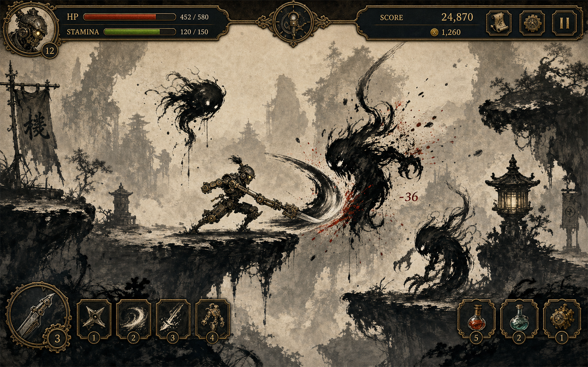

# InkWarrior 기획서

문제 정의: 액션 플레이어가 타격감뿐 아니라 수묵풍 연출과 명확한 위험 신호를 함께 원한다.

## 게임 소개
먹과 검의 리듬을 살린 액션 전투 게임.

## 핵심 루프
유저가 현재 전장의 정보를 읽고 선택을 하면 전투/운영 결과가 갱신되고, 그 보상과 손실 때문에 다시 다음 선택을 준비한다.

## 게임 플레이 예시

- 플레이어가 InkWarrior의 현재 목표, 보유 자원, 즉시 대응해야 할 위험을 확인한다.
- 현재 상황에 맞는 핵심 행동을 선택한다.
- 선택 결과가 전투, 보상, 손실로 즉시 갱신되고 다음 판단의 근거가 된다.

## 현재 구현 상태
- 전체 게임 루프, 캐릭터 교체, 무한 청크 맵, 적/추격자 전투가 구현되어 있다.
- 생성 아트 에셋과 수묵 액션 피드백이 적용되어 있다.
- CameraImpactProfile 순수 규칙으로 기본 히트, 콤보, 처치, 스킬, 추격자 러시의 카메라 흔들림/줌/플래시/방향 넛지를 관리한다.
- UI 디자이너 후속 작업 목록은 `docs/ui-designer-camera-impact-tasks.md`에 정리했다.

## 남은 리스크와 다음 우선순위
- BGM/SFX 오디오
- 3번째 캐릭터 추가
- 추격자 패턴 다양화
- 특수 지형 / 이벤트 청크
- 밸런싱 세부 조정

## 빌드, 테스트, 릴리스
- npm test
- npm run build
- 현재 문서 기준 버전: 0.2.0

## v0.2.0 카메라 타격 연출
- CameraImpactProfile 순수 규칙을 추가해 기본 히트, 콤보, 처치, 스킬, 추격자 러시의 카메라 흔들림/줌/플래시/방향 넛지를 분리했다.
- 참격 방향을 카메라 follow offset에 반영해 붓 획이 밀고 나가는 방향으로 짧게 눌렸다가 복귀하도록 했다.
- UI 디자이너 후속 작업 목록을 `docs/ui-designer-camera-impact-tasks.md`에 정리했다.
