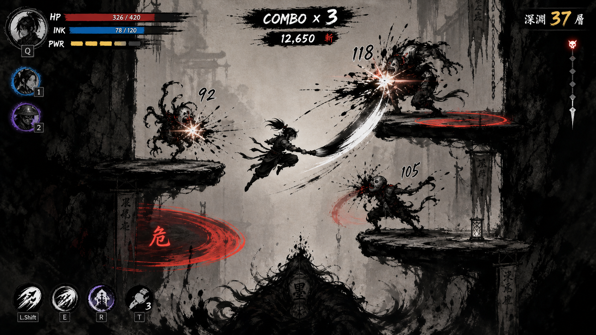

# InkWarrior 기획서
> 현재 문서 기준 버전: 0.12.0

## 현재 구현 상태
- 현재 문서 기준 버전: 0.11.0
- Phaser 3 + Electron portable 구조를 유지한다.
- ActionFeedback은 strike, evade, wound, finish, failure 피드백을 관리하고 각 피드백에 Kenney CC0 SFX cue를 포함한다.
- GameScene은 ActionFeedback의 anchor, layer, timeline, densityCue, sfx cue를 사용해 첫 30초 전투 피드백을 표시하고 재생한다.
- CameraImpactProfile 순수 규칙으로 기본 히트, 콤보, 처치, 스킬, 추격 카메라 반응을 관리한다.
- UI 디자이너 후속 작업 목록은 docs/ui-designer-camera-impact-tasks.md에 유지한다.

## 적용 리소스
| 파일명 | 용도 |
|---|---|
| `assets/generated/brush-slash.png` | 기본 공격 경고와 참격 VFX |
| `assets/generated/impact-brush-ring.png` | 공격 접촉 링 VFX |
| `assets/generated/impact-ink-burst.png` | 처치/강타 잉크 폭발 VFX |
| `assets/generated/combo-brush-smear.png` | 콤보 연속 공격 번짐 VFX |
| `assets/generated/heavy-hit-flash.png` | 3타/피니셔 플래시 |
| `assets/audio/kenney/sfx_attack_slash.ogg` | Kenney Digital Audio `Audio/laser5.ogg`, 공격 |
| `assets/audio/kenney/sfx_dodge_guard.ogg` | Kenney Digital Audio `Audio/phaseJump1.ogg`, 회피/가드 |
| `assets/audio/kenney/sfx_hit_impact.ogg` | Kenney Impact Sounds `Audio/impactPunch_medium_000.ogg`, 적 피격 |
| `assets/audio/kenney/sfx_player_hurt.ogg` | Kenney Impact Sounds `Audio/impactSoft_medium_000.ogg`, 플레이어 피격 |
| `assets/audio/kenney/sfx_enemy_defeat.ogg` | Kenney Impact Sounds `Audio/impactBell_heavy_002.ogg`, 처치 |
| `assets/audio/kenney/sfx_stage_fail.ogg` | Kenney Interface Sounds `Audio/error_003.ogg`, 실패 |

## 남은 리스크와 다음 우선순위
| 우선순위 | 작업 | 이유 |
|---|---|---|
| 1 | 실제 플레이 캡처로 SFX 믹스 볼륨 확인 | 샘플은 연결됐지만 전투 중 반복 재생 체감은 수동 QA가 필요하다. |
| 2 | HUD 콤보 텍스트와 리듬감 우선순위 조정 | 코어 피드백 과밀을 줄여 화면 가독성을 유지한다. |

## 빌드, 테스트, 릴리스
| 목적 | 명령 |
|---|---|
| 테스트 | `npm test -- --runInBand` |
| 실행파일 패키지 | `npm run build` |

## 2026-07-15 v0.11.0 Kenney Combat SFX Runtime Update

Kenney CC0 SFX 6개를 첫 30초 전투 판독 이벤트에 연결했다. `ActionFeedback`은 기존 label/tone/texture/rule API를 유지하면서 `sfx` cue를 추가하고, `GameScene._showActionFeedback()`이 샘플 우선 재생 헬퍼를 통해 공격, 회피/가드, 피격, 처치, 실패 사운드를 재생한다. 실패 화면은 `GameOverScene`에서 `sfx_stage_fail`을 직접 재생한다. Source attribution lives next to the runtime files in `assets/audio/kenney/README.md`.

---
# InkWarrior 湲고쉷??
> ?꾩옱 臾몄꽌 湲곗? 踰꾩쟾: 0.10.0

## 臾몄젣 ?뺤쓽
吏㏃? ?몄뀡?먯꽌 鍮좊Ⅴ寃??먮쭧???먮겮怨??띠? PC ?≪뀡 ?뚮젅?댁뼱媛€ 怨듦꺽, ?뚰뵾, ?쇨꺽, 泥섏튂 寃곌낵瑜?利됱떆 ?쎌? 紐삵븯硫??꾪닾媛€ 諛뗫컠?섍쾶 ?먭뺨吏꾨떎. InkWarrior???섎У VFX, 移대찓??諛섏쓳, ??由ъ븸?섏쓣 媛숈? ?꾨젅?꾩뿉 臾띠뼱 "吏€湲??쒕?濡?留욎톬?????뺤떊??二쇰뒗 ?≪뀡 ?뚮옯??寃뚯엫?대떎.

## 二??섎Ⅴ?뚮굹
?대룄?? 26?? ?붿옄???꾧났 ?€?숈썝?? ?묒뾽 ?ъ씠 5~20遺??숈븞 紐곗엯?????덈뒗 ?≪뀡 寃뚯엫??李얘퀬, Dead Cells??Hollow Knight泥섎읆 ?낅젰 寃곌낵媛€ ?좊챸?섍쾶 ?뚯븘?ㅻ뒗 ?꾪닾瑜??좏샇?쒕떎.

## ?듭떖 猷⑦봽
?뚮젅?댁뼱媛€ 異붽꺽?먯? ??諛곗튂瑜??뺤씤?쒕떎 ??怨듦꺽, ?뚰뵾, ?ㅽ궗, 罹먮┃??援먯껜瑜??좏깮?쒕떎 ???섎У VFX?€ ??由ъ븸?섏쑝濡?寃곌낵瑜??쎈뒗?????뚮났 ?쒕엻怨??먯닔瑜?梨숆릿?????ㅼ쓬 泥?겕?€ ?ㅼ쓬 ?꾪닾濡??대룞?쒕떎.

## ?꾩옱 援ы쁽 ?곹깭
- ?꾩옱 臾몄꽌 湲곗? 踰꾩쟾: 0.10.0
- Phaser 3 + Electron portable 援ъ“濡?鍮뚮뱶?쒕떎.
- ?꾩껜 寃뚯엫 猷⑦봽, 罹먮┃??援먯껜, 臾댄븳 泥?겕 留? ??異붽꺽???꾪닾媛€ 援ы쁽?섏뼱 ?덈떎.
- ActionFeedback 洹쒖튃?쇰줈 strike, evade, wound, finish 肄쒖븘?껋쓣 愿€由ы븳??
- CameraImpactProfile ?쒖닔 洹쒖튃?쇰줈 湲곕낯 ?덊듃, 肄ㅻ낫, 泥섏튂, ?ㅽ궗, 異붽꺽???ъ떆??移대찓???붾뱾由?以??뚮옒??諛⑺뼢 ?쏆?瑜?愿€由ы븳??
- ComboHitReaction ?쒖닔 洹쒖튃?쇰줈 1?€/2?€/3?€ ???됰갚, 寃쎌쭅, smear, ?쇰땲???뚮옒?? ?쒕엻 吏€?? combo-specific impact VFX stack??遺꾨━?덈떎.
- UI ?붿옄?대꼫 ?꾩냽 ?묒뾽 紐⑸줉?€ docs/ui-designer-camera-impact-tasks.md???뺣━?덈떎.

## MVP 媛€??
1. 怨듦꺽 寃곌낵媛€ 0.5珥??덉뿉 肄쒖븘?? VFX, ??由ъ븸?섏쑝濡??숈떆???꾨떖?섎㈃ ?뚮젅?댁뼱媛€ ?꾪닾 ?먯젙????紐낇솗???댄빐?쒕떎.
2. 1?€/2?€/3?€媛€ ??諛섏쓳?쇰줈 援щ텇?섎㈃ 肄ㅻ낫媛€ ?⑥닚 諛섎났???꾨땲???꾩꽦?섎뒗 遺??띿쿂???먭뺨吏꾨떎.
3. 泥섏튂 ?쒕엻???쇰땲??癒???컻 ??0.1珥?吏€?곕릺硫?蹂댁긽怨??€寃??ъ슫???????곌껐?쒕떎.

## ?덊띁?곗뒪 遺꾩꽍
| 寃뚯엫 | ?듭떖 ?됰룞 ?④퀎 | ?곸슜 援먰썕 |
|---|---:|---|
| Dead Cells | 吏꾩엯 ??怨듦꺽/?뚰뵾 ???쇰뱶諛??뺤씤, 3?④퀎 | ??由ъ븸?섍낵 ?붾㈃ 諛섏쓳??媛숈? ?꾨젅?꾩뿉 留욎븘???먮쭧???좊챸?섎떎. |
| Hollow Knight | ?대룞 ??怨듦꺽 ???곹샇 ?쇰뱶諛????ъ쐞移? 4?④퀎 | ?깃났?€ 怨쇱옣?섍퀬 ?쇨꺽?€ ?쒗븳???뚮젅?댁뼱 ?먮떒??諛⑺빐?섏? ?딅뒗?? |
| Katana ZERO | ?⑦꽩 ?쎄린 ???щ줈紐⑥뀡 ?먮떒 ??泥섏튂 ?뺤씤, 3?④퀎 | 吏㏃? ?뺤??€ 媛뺥븳 ?쒓컖 諛섏쓳?€ 怨듦꺽 ?깃났??利됱떆 媛곸씤?쒗궓?? |

## ?섎У ?꾪닾 ?쇰뱶諛?洹쒖튃
| ?쇰뱶諛??좏삎 | 肄쒖븘??| VFX | 移대찓??由ъ븸??|
|---|---|---|---|
| 湲곕낯 怨듦꺽 strike | 遺볤만 ?덇퀬, 1??李멸꺽 | brush slash + light impact brush ring | ?쏀븳 ?붾뱾由? ??吏㏃? ?€李?|
| 肄ㅻ낫 2?€ | 2??李멸꺽 | impact brush ring + combo brush smear | 以묎컙 ?됰갚, 130ms 寃쎌쭅 |
| 肄ㅻ낫 3?€ | 3??李멸꺽 | impact brush ring + combo brush smear + heavy hit flash + ink burst | ???됰갚, 210ms 寃쎌쭅, 72ms hit-stop |
| 泥섏튂 finish | 癒밸Ъ ??뇙 | impact ink burst | 媛뺥븳 ?붾뱾由? ?쒕엻 100ms 吏€??|
| ?뚰뵾 evade | ?€???붿긽 | smoke/afterimage | 諛⑺뼢???붿긽 |
| ?쇨꺽 wound | 癒밸쾲吏?寃쎌쭅 | blood ink | 吏㏃? ?붾뱾由?|

## ?깃났 KPI
| 吏€??| 紐⑺몴 |
|---|---:|
| ?됯퇏 ?몄뀡 ?뚮젅???쒓컙 | 8遺??댁긽 |
| 肄ㅻ낫 5?곗냽 ?댁긽 ?ъ꽦 ?몄뀡 鍮꾩쑉 | 40% ?댁긽 |
| 寃뚯엫?ㅻ쾭 ??30珥????ъ떆?묐쪧 | 60% ?댁긽 |
| 泥섏튂 ???뚮났 ?쒕엻 ?띾뱷瑜?| 70% ?댁긽 |

## ?곸슜 由ъ냼??
| ?뚯씪紐?| ?⑸룄 |
|---|---|
| brush-slash.png | 怨듦꺽 ?덇퀬?€ 湲곕낯 李멸꺽 bitmap VFX |
| impact-brush-ring.png | 李멸꺽 留?bitmap VFX |
| impact-ink-burst.png | 泥섏튂/媛뺥?寃?癒???컻 |
| combo-brush-smear.png | 肄ㅻ낫 ?곗냽 怨듦꺽 踰덉쭚 |
| heavy-hit-flash.png | 3?€ ?쇰땲???뚮옒??|
| life-orb.png | 泥섏튂 ???뚮났 ?쒕엻 |

## 鍮뚮뱶, ?뚯뒪?? 由대━??
| 紐⑹쟻 | 紐낅졊 |
|---|---|
| ?뚯뒪??| `npm test` |
| ?ㅽ뻾?뚯씪 ?⑦궎吏€ | `npm run build` |

## ?⑥? 由ъ뒪?ъ? ?ㅼ쓬 ?곗꽑?쒖쐞
| ?곗꽑?쒖쐞 | ?묒뾽 | ?댁쑀 |
|---|---|---|
| 1 | 肄ㅻ낫 3?€ ???뺢? 媛믪쓣 ?ㅼ젣 ?뚮젅???곸긽?쇰줈 ?쒕떇 | VFX stack?€ 媛뺥솕?먯?留?臾쇰━ ?뺢???怨쇳븯硫????꾩튂 ?덉륫???대젮?뚯쭊?? |
| 2 | SFX ?€寃⑹쓬 ?덉씠??異붽? | ?쒓컖 ?쇰뱶諛깅쭔?쇰줈???먮쭧 ?꾨떖???덈컲留??꾩꽦?쒕떎. |
| 3 | HUD 肄ㅻ낫 ?띿뒪?몄? ??由ъ븸??媛??곗꽑?쒖쐞 議곗젙 | 肄쒖븘??怨쇰???以꾩뿬 ?섎У ?붾㈃ 媛€?낆꽦???좎??쒕떎. |

## 2026-06-26 v0.5.0 Visual Resource Update

The combat feedback VFX set was refreshed with image-generated sumi-e dieselpunk PNG assets while preserving the existing runtime paths and texture keys.

| File | Use |
| --- | --- |
| `assets/generated/brush-slash.png` | Basic attack warning and slash feedback |
| `assets/generated/impact-brush-ring.png` | Contact ring on attack impact |
| `assets/generated/impact-ink-burst.png` | Kill and heavy impact ink burst |
| `assets/generated/combo-brush-smear.png` | Combo continuation smear |
| `assets/generated/heavy-hit-flash.png` | Third-hit / finisher flash |

Verification plan: `npm test`, `npm run build`, and final Electron packaging after the instruction batch is complete.

## 2026-06-29 v0.6.0 Combo Impact VFX Runtime Update

Combo hit reactions now expose a combo-specific `impactVfx` stack that the runtime scene consumes directly: 1?€ uses a light brush ring, 2?€ adds a directional combo smear, and 3?€ layers ring, smear, heavy-hit flash, and ink burst. This keeps the existing generated PNG assets and texture keys while making combo 2 and combo 3 read as distinct impact beats.
## 2026-06-30 v0.7.0 Boundary Wall Update

醫뚯슦濡????대룞?????녿뒗 ?곸뿭???뉗? 留덉빱媛€ ?꾨땲???섎У 踰쎌쑝濡??쏀엳?꾨줉 媛쒖꽑?덈떎. `PlayAreaBounds`媛€ ?뚮젅??媛€???? 臾쇰━ 踰??꾩튂, 踰?鍮꾩＜???꾩튂瑜?怨듯넻 怨꾩궛?섍퀬, `GameScene`?€ 醫뚯슦 static wall collider?€ 怨좎젙 ?붾㈃ ?섎У 踰?湲덉깋 ?댁륫 ?쇱씤???④퍡 ?앹꽦?쒕떎. ?뚮젅?댁뼱??湲곗〈 以묒븰 ?뚮젅???덉씤 ?덉뿉?쒕쭔 ?€吏곸씠硫? 踰쎌? ?쒓컖?곸쑝濡쒕룄 留됲엺 怨듦컙?꾩쓣 利됱떆 ?꾨떖?쒕떎.

## 2026-06-30 v0.8.0 Side Platform Lane Update

以묒븰 履?諛쒗뙋??怨쇳븯寃??앹꽦?섏뼱 ?대룞 寃쎈줈媛€ ?⑥“濡?쾶 蹂댁씠??臾몄젣瑜?以꾩씠湲??꾪빐 `PlatformLanePlan`??異붽??덈떎. 湲곕낯 蹂댁옣 諛쒗뙋?€ 醫???以묒떖?쇰줈 ?좎??섍퀬, 異붽? ?쒕뜡 諛쒗뙋?€ 以묒븰 湲덉? 諛대뱶瑜??쇳빐 醫뚯륫 ?먮뒗 ?곗륫 spawn band?먯꽌 ?앹꽦?쒕떎. 洹?寃곌낵 ?붾㈃ 以묒븰?€ ??鍮꾩썙???숉븯/?먰봽 ?먮떒 怨듦컙?쇰줈 ?쏀엳怨? 醫뚯슦 踰쎄낵 ?덉씤 援ъ“媛€ ??紐낇솗?댁쭊??

## 2026-06-30 v0.10.0 Grotesque Monster Variant Update

??洹몃줈?뚯뒪?ы븯怨??붿컢???뺥깭???곸씠 ?먯＜ 蹂댁씠?꾨줉 肄붾뱶 ?앹꽦 ?띿뒪泥?湲곕컲 愿대Ъ 蹂€醫낆쓣 異붽??덈떎. `MonsterVariantPlan`?€ spawn ?꾩튂瑜?湲곗??쇰줈 `enemy_maw`, `enemy_spine`, `enemy_many_eyes`, `enemy_crawler` 以??섎굹瑜??덉젙?곸쑝濡??좏깮?섍퀬, 媛?蹂€醫낆? ?ш린, 異⑸룎 諛뺤뒪, ?대룞 ?띾룄, 怨듦꺽??蹂대꼫?? ?됲겕 tint媛€ ?ㅻⅤ寃??곸슜?쒕떎. ?쒖옉 ?댄썑 泥?겕?????섎뒗 2~4泥대줈 ?섎젮 ?꾪닾 諛€?꾩? ?꾪삊媛먯쓣 ?믪???

## 2026-07-02 v0.10.0 Package Metadata Compatibility

諛고룷 ?먮룞?붿? PowerShell 湲곕컲 媛먯궗 ?ㅽ겕由쏀듃?먯꽌??`package.json`???덉젙?곸쑝濡??쎌쓣 ???덈룄濡?distribution metadata瑜?ASCII-safe 媛믪쑝濡?怨좎젙?덈떎. `description`?€ `Ink-brush action platformer`, `author`??`Jinwoo Oh`濡??뺣━?덉쑝硫? `tests/PackageMetadata.test.js`媛€ ?숈씪???뚭? 議곌굔??寃€利앺븳??

- Validation: `npm test -- --runInBand` passed 39 suites / 122 tests.
- Build: `npm run build` produced `release/21NL_v0.10.0_portable.exe`.
- Release copy: latest executable was copied to `21NL_v0.10.0_portable.exe` in the project root and `G:\???쒕씪?대툕\?ㅽ뻾?뚯씪\21_InkWarrior_v0.10.0_portable.exe`.
## 2026-07-15 v0.11.0 Kenney Combat SFX Runtime Update

Kenney CC0 SFX 6개를 첫 30초 전투 판독 이벤트에 연결했다. `ActionFeedback`은 기존 label/tone/texture/rule API를 유지하면서 `sfx` cue를 추가하고, `GameScene._showActionFeedback()`이 샘플 우선 재생 헬퍼를 통해 공격, 회피/가드, 피격, 처치, 실패 사운드를 재생한다. 실패 화면은 `GameOverScene`에서 `sfx_stage_fail`을 직접 재생한다.

| Runtime file | Original pack | Original file | Event |
| --- | --- | --- | --- |
| `assets/audio/kenney/sfx_attack_slash.ogg` | Kenney Digital Audio | `Audio/laser5.ogg` | Attack |
| `assets/audio/kenney/sfx_dodge_guard.ogg` | Kenney Digital Audio | `Audio/phaseJump1.ogg` | Dodge / guard |
| `assets/audio/kenney/sfx_hit_impact.ogg` | Kenney Impact Sounds | `Audio/impactPunch_medium_000.ogg` | Enemy hit |
| `assets/audio/kenney/sfx_player_hurt.ogg` | Kenney Impact Sounds | `Audio/impactSoft_medium_000.ogg` | Player hit / stagger |
| `assets/audio/kenney/sfx_enemy_defeat.ogg` | Kenney Impact Sounds | `Audio/impactBell_heavy_002.ogg` | Kill / defeat |
| `assets/audio/kenney/sfx_stage_fail.ogg` | Kenney Interface Sounds | `Audio/error_003.ogg` | Failure |

Source attribution lives next to the runtime files in `assets/audio/kenney/README.md`. Google Drive upload is intentionally deferred to the controller.

## 2026-07-27 v0.12.0 Combat Signal Silhouettes

- `ActionFeedback` now assigns a distinct visual cue silhouette to attack, dodge, stagger, and defeat: slash, afterimage, wound, and burst.
- `GameScene._showActionFeedback()` renders that cue one depth behind the existing readable label, preserving the established anchor, lane, and timeline rules.
- Verification: `npm test` and `npm run build`.
